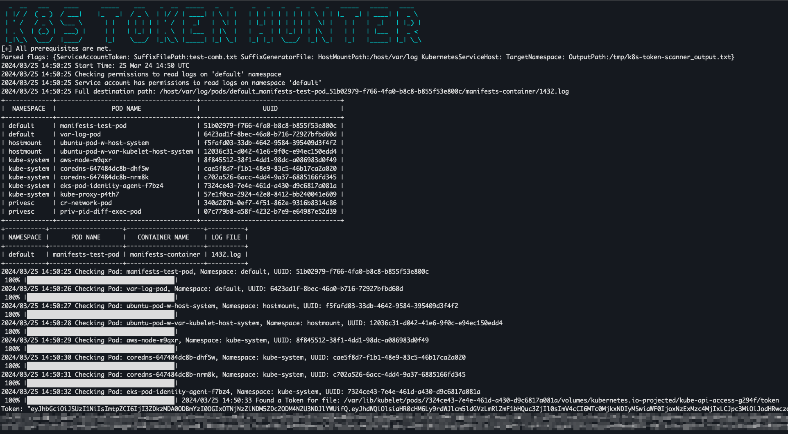

# K8S TOKEN HUNTER



This repository introduces a Go-based automated tool for hunting Kubernetes service account tokens stored on the worker nodes.

---

## Table of Contents
- [Description](#description)
- [Installation](#installation)
- [Usage](#usage)
- [Example](#example)
- [Documentation](#documentation)
- [Disclaimer](#disclaimer)
- [License](#license)

---
## Description

The `/var/log` directory in Kubernetes is used for storing pod container logs on nodes. This directory, however, can be manipulated by an attacker to create symlinks to sensitive files on the host system.

The tool focuses on the `/var/lib/kubelet/pods` directory, demonstrating how a writable `/var/log` host path directory mounted to a pod could be abused to access service account tokens. Kubernetes service account tokens are stored on the `/var/lib/kubelet/pods directory` the following structure: `{podUID}/volumes/kubernetes.io~projected/kube-api-access-{random suffix}/token`, where `podUID` can be retrieved from the `/var/log/pods` directory, and random suffix are 5 random lower case characters.

The tool abuses service account permissions to read logs and employs a brute-force technique to create symlinks for all possible suffix combinations, aiming to hunt for service account tokens.


## Prerequisites

Before deploying the K8s Token Hunter tool, ensure that you have:
* Ability to run commands on a running pod as root
* Writeable `/var/log` host path directory mounted to a pod
* `GET` RBAC permissions to `pods/log` sub-resource in the `core` API group binded to a service account
* The Go runtime environment, to build the tool from source.
* kubectl installed on the running pod

## Installation

To install the K8s-token-hunter tool, follow these steps:

1. Clone the repository to your local machine or directly to the pod where the tool will be deployed:
`git clone https://github.com/reemrotenberg/k8s-token-hunter.git`
2. Navigate to the cloned repository directory:
`cd k8s-token-hunter/cmd`
3. Build the binary from source (skip this step if you have a pre-built binary):
`go build -o k8s-token-hunter .`
4. Deploy the binary to the target pod within your Kubernetes cluster.


## Usage

After deploying the tool to the pod, execute it using one of the following methods: 
1. Generating suffix list: 
`./k8s-token-hunter --generate-suffix-list="SUFFIX_FILE_PATH" --suffix-file="SUFFIX_FILE_PATH" --mount-path="HOST_PATH_TO_VAR_LOG"`
2. Using already exist combination list:
`./k8s-token-hunter --suffix-file="SUFFIX_FILE_PATH" --mount-path="HOST_PATH_TO_VAR_LOG"`
3. Using a user-supplied token: Provide the token as an argument to the binary.
`./k8s-token-hunter --token="YOUR_SERVICE_ACCOUNT_TOKEN" --suffix-file="SUFFIX_FILE_PATH" --mount-path="HOST_PATH_TO_VAR_LOG"`

## Example

Pod with /var/log host path mounted yaml snippet
```
    ...
    volumeMounts:
      - name: host-var-log
        mountPath: /host/var/log
  volumes:
    - name: host-var-log
      hostPath:
        path: /var/log
```
Read logs role yaml snippet example
```
apiVersion: rbac.authorization.k8s.io/v1
kind: Role
metadata:
  namespace: default
  name: get-logs-role
rules:
- apiGroups: [""]
  resources: ["pods/log"]
  verbs: ["get"]
```

`./k8s-token-hunter --generate-suffix-list="/tmp/combinations.txt" --suffix-file="/tmp/combinations.txt" --mount-path="/host/var/log"`

## Documentation

```
./k8s-token-hunter -h
K8s Token Hunter is a tool that exploits the /var/log host path mount to hunt Kubernetes tokens

Usage:
  k8s-token-hunter [flags]

Flags:
  -l, --generate-suffix-list string      File path for the suffix combintations list
  -h, --help                             help for k8s-token-hunter
  -k, --kubernetes-service-host string   Kubernetes API server IP address
  -m, --mount-path string                According to the pod manifest, the /var/log host path has been mounted to the pod (required)
  -o, --output-path string               Output path for the hunted tokens (default "/tmp/k8s-token-scanner_output.txt")
  -s, --suffix-file string               Suffix file path (required)
  -n, --target-namespace string          Namespace to target
  -t, --token string                     Service account token
```

## Disclaimer 
The use of the code provided herein is intended solely for educational and security-testing purposes on systems where you have explicit authorization to conduct such activities. Misuse of this code to access, modify, or exploit systems without proper consent is strictly prohibited and may violate privacy laws, data protection statutes, and ethical standards. It is the user's responsibility to ensure lawful and ethical application of this tool. The creators and distributors of the code assume no liability for any unauthorized or improper use of the code, and are not responsible for any direct or indirect damages or legal repercussions that may arise from such misuse. Please use this code responsibly and ethically.

## License
This project is licensed under the MIT license - see the [LICENSE.md](LICENSE) file for details.